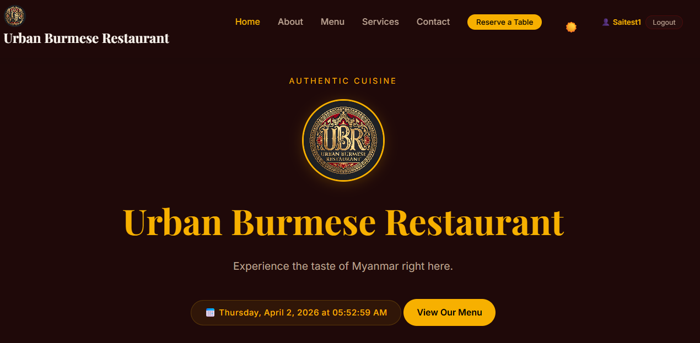

# Urban Burmese Restaurant

A full-stack restaurant web app built with PHP, MySQL, and vanilla JavaScript. 

I built this to handle standard restaurant site features like user authentication, table reservations, and food ordering. The frontend is pretty clean and includes some custom scroll-driven animations for the menu items, plus a built-in dark/light mode toggle.



## Features
- **Auth:** User registration, login, and profile management.
- **Reservations:** Book tables and check past bookings.
- **Orders:** Place and track food orders.
- **UI:** Fully responsive with a dark/light mode switch.
- **Animations:** Scroll-triggered effects on the landing page.

## Tech Stack
- Frontend: HTML, CSS, Vanilla JS
- Backend: PHP 8
- Database: MySQL

## Setup
1. Make sure you have XAMPP, MAMP, or a similar local server running.
2. Clone this repo into your `htdocs` (or equivalent) folder:
   ```bash
   git clone [https://github.com/YOUR_USERNAME/Urban_Burmese_Project.git](https://github.com/YOUR_USERNAME/Urban_Burmese_Project.git)
> [!NOTE]
> **Static Hosting Limitation:** This live preview is hosted on a static platform. Because of this, backend features like user registration, table bookings, and food ordering (which require PHP and MySQL) currently do not work and will show errors. To see the full functionality, please follow the **Setup** instructions below to run it locally.